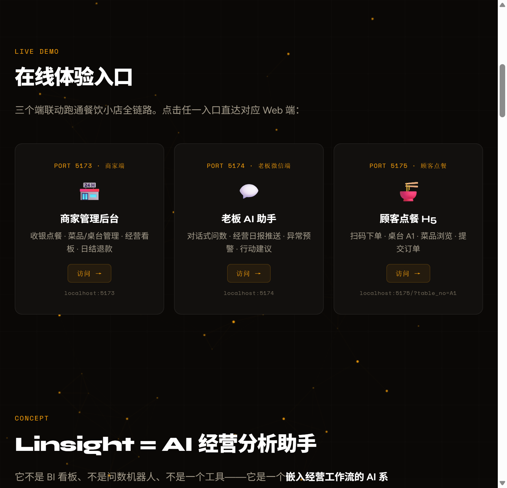
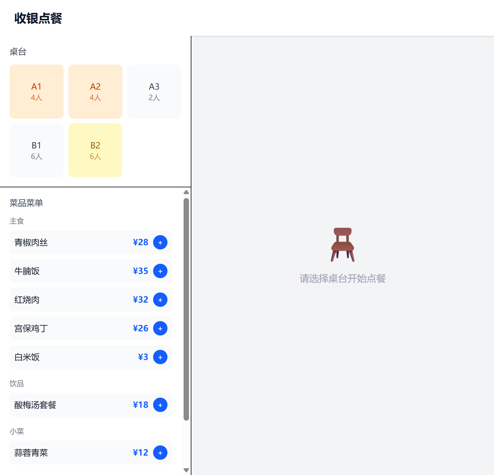
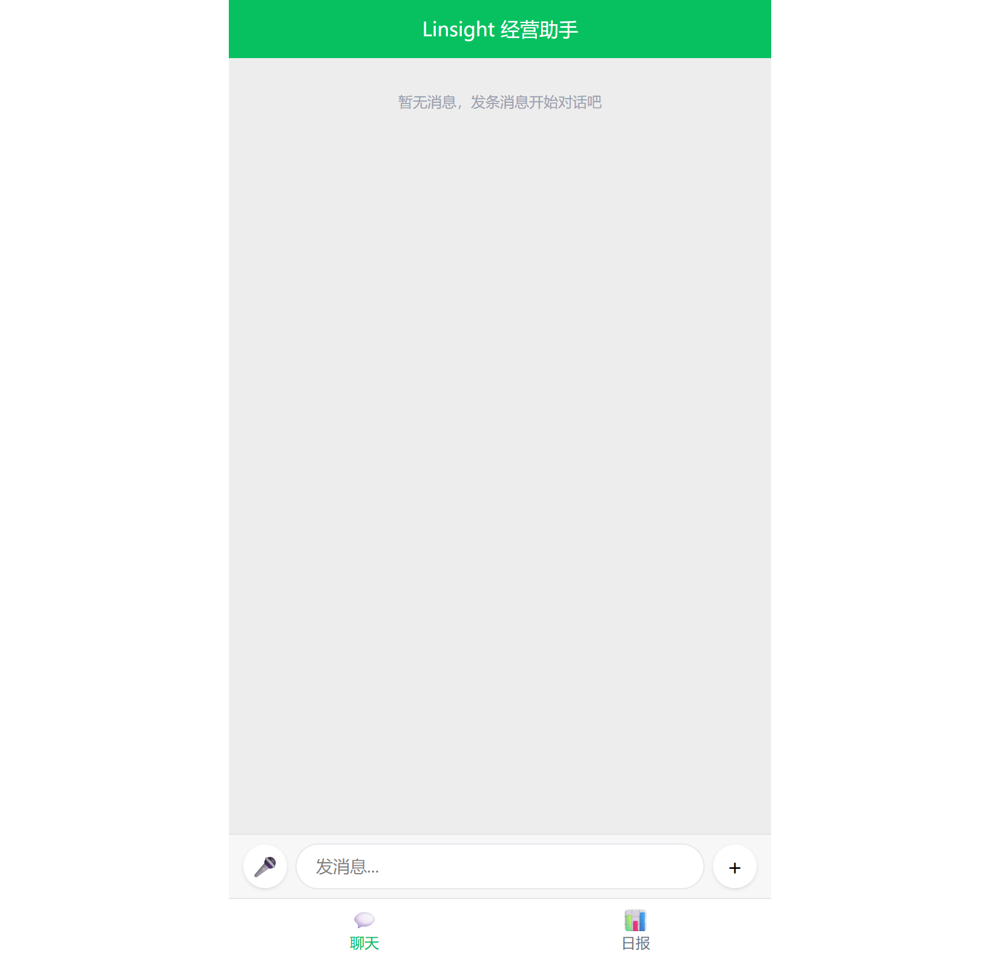
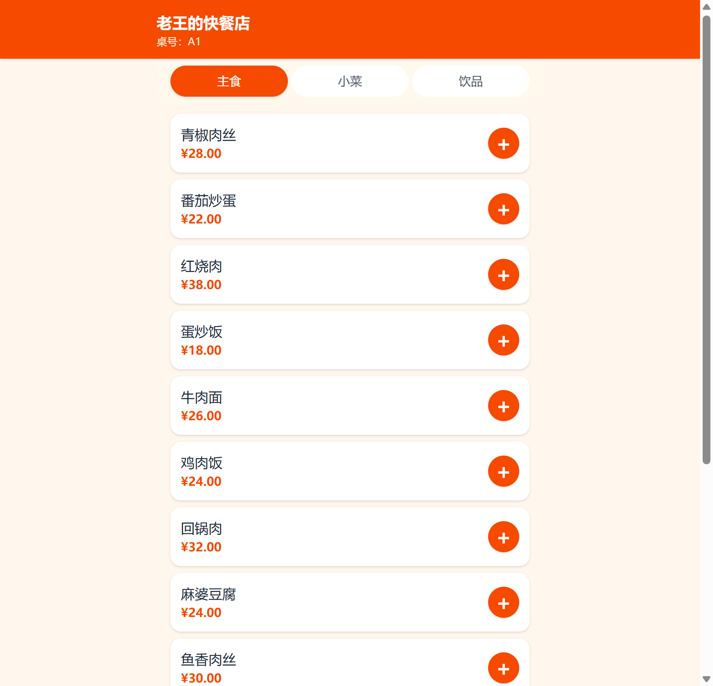

# TRAE AI 创造力大赛 · 初赛作品帖

## 【标签】
社会服务

## 【标题】
社会服务 + Linsight：嵌入工作流的 AI 经营分析助手，让老板不费劲就能看懂经营状况

---

## 1. Demo 简介

**是什么**：Linsight（Lens + Insight）是一个**嵌入经营工作流的 AI 系统**。它不是工具、不是 BI、不是问数机器人——它让数据在业务流程中自然产生，让 AI 主动把经营状况推到老板面前，让老板做事的方式本身发生改变。

**面向谁**：中国数以千万计的中小企业老板——他们请不起专职经营分析师，数据在手上但看不懂，指标很重要但不会算，每天凭感觉做决策。Linsight 服务的是企业的"一号位"。

**核心定位**：
> **经营分析是切入点，工作流再造是终点。**
>
> 今天它是「帮老板看懂经营的助手」，明天它是「嵌入老板做事方式的一部分」。

**本次 Demo 以餐饮小店为案例场景**，三端联动跑通完整闭环：

- **老板端**（微信风格）：发图识别进货单 → 确认入库；看日报 / 盘点 / AI 洞察
- **商家端**（11 个页面）：收银点餐 / 厨房看板 / 桌台 / 订单 / 菜品 / 库存 / 采购 / 日结 / 损耗 / 日报 / 退款
- **顾客端**（H5）：菜单 → 确认 → 支付 → 成功 → 订单状态
- **落地页**：三个独占壁垒 + 「老板的一天」时间轴控制器（可点击切换场景，1 分钟体验一天闭环）




---

## 2. Demo 创作思路

### 灵感来源

创始人是商业分析背景，最擅长的事就是帮企业看懂数据、算指标、找异常、给建议。但这件事从来都是只有大企业才请得起分析师才能做的——

> **它不应该是只有分析师才能做的事，它应该是每个老板的系统能力。**

这个判断被李开复 2026 年的一篇访谈印证（虎嗅独家对话，2026.06.24）：

> **"AI 不是给旧流程装插件，而是重写一家公司的组织、流程和决策方式。"**
> **"CEO 真正关心的，不是多装几个软件，而是收入、利润、增长率和风险。"**

Linsight 继承了三个核心理念：
1. **一号位工程** — 用户就是企业的"一号位"，系统直接对老板的决策和经营结果负责
2. **交付结果，不是交付工具** — 不是给老板一个报表让他自己看，而是让分析成为自动发生的事
3. **AI 不是给旧流程装插件** — 经营分析是第一步，终局是让 AI 成为经营方式本身

### 想解决的问题

这是所有老板最痛的共通点：
- 餐饮老板想知道食材成本率有没有超标
- 制造业老板想知道哪个产品线最赚钱
- 零售老板想知道库存周转正不正常
- **共同点是：数据在手上，但看不懂；指标很重要，但不会算。**

现有方案都解决不了：
| 现有方案 | 问题 |
|---------|------|
| 传统 BI 看板 | 太重，老板学不会，要主动打开 |
| 记账 App | 只记录不分析，老板要自己解读数字 |
| 问数机器人 | 需要老板"知道该问什么"，但老板恰恰不知道 |
| SaaS 系统 | 给旧流程装插件，要老板学新工具、改习惯 |

### 三个独占壁垒（本次 Demo 已全部实现）

Linsight 与所有现有方案的根本差异，集中在三个"独占壁垒"上——这三件事别的系统做不到或不愿做：

#### ① 拍照入账（工作流嵌入）

老板拍张进货单照片发到微信群——这是他本来就在做的动作。Linsight 的 AI 自动识别进货单（供应商/商品/数量/单价/金额），落库为待确认采购单，推回一张预览卡片。老板点「确认入库」，库存批次自动插入，保质期预警自动设置。

> 老板没有"使用系统"，他只是发了张照片。

**Demo 体验**：老板端 → 聊天页 → 点「＋」→ 选预设进货单 → 收到识别卡片（含异常预警：牛肉单价偏高 8%）→ 点「确认入库」→ 库存联动。

#### ② 损耗监控（差值即洞察）

Linsight 自动算两笔账：
- **理论消耗** = 卖出的菜 × 配方 BOM
- **实际消耗** = 期初库存 + 采购 - 期末实盘

两者差值就是洞察：差值为正说明实际消耗比理论多（偷漏 / 浪费），差值为负说明有未记录销售。差异金额超阈值，AI 主动产生告警推到老板的洞察列表。

> 老板不需要主动查损耗，AI 发现异常会主动找他。

**Demo 体验**：商家端 → 损耗监控页 / 老板端 → 盘点页 → 录入实盘 → 系统算差异 → 洞察页收到告警。

#### ③ 日报推送（数据来找你）

每天，Linsight 自动算营收 / 食材成本 / 人工 / 损耗 / 毛利 / 净利 / 客流 / 客单价 / TOP5 菜品 / 单品利润明细，AI 生成人话摘要 + 行动建议，主动推送到老板微信。

> 老板不用打开任何报表，早上 8 点 AI 主动告诉他昨天怎么样、今天该做什么。

**Demo 体验**：老板端 → 日报 tab → 选 2026-07-09 → 生成日报 → 看完整指标 + AI 建议（如「对账差异 -2132 元，建议核查」）→ 洞察 tab 看异常预警。

### 老板的一天（完整闭环）

落地页的「老板的一天 · 时间轴控制器」把这个闭环做成了可交互体验——评委点击时间轴节点即可切换场景，1 分钟看完一天：

| 时间 | 老板在做什么 | Linsight 在做什么 |
|------|------------|-----------------|
| 早 8:00 | 收到微信推送 | AI 生成昨日经营日报 + 行动建议，主动推送 |
| 10:30 | 拍照发进货单 | AI 识别入库 + 价格异常反问 |
| 营业中 | 顾客下单、商家收银 | 数据自然产生，库存 FIFO 自动扣减 |
| 22:30 | 关店 | AI 算理论 vs 实际消耗差异，异常主动告警 |
| 次日 8:00 | 收到新日报 | 闭环 |

---

## 3. Demo 体验地址

**本地体验**（需启动 4 个服务，详见 `Demo体验指南.md`）：
- 落地页：`index.html`（双击打开）
- 商家管理后台：http://localhost:5173
- 老板 AI 助手：http://localhost:5174
- 顾客点餐 H5：http://localhost:5175/?table_no=A1

**启动方式**：
```bash
# 4 个终端分别运行
cd server && npm run db:init && npm run db:seed && npm run dev   # 后端 3001
cd web    && npm run dev   # 商家端 5173
cd wechat && npm run dev   # 老板端 5174
cd h5     && npm run dev   # 顾客端 5175
```

**推荐体验路径**（5–8 分钟闭环）：
1. **落地页** → 理解产品定位 + 三个独占壁垒 + 时间轴控制器看一天闭环
2. **老板端** (5174) → 聊天页点「＋」发预设进货单 → 收到识别卡片 → 点「确认入库」（独占壁垒①）
3. **商家端** (5173/inventory) → 看库存因刚才入库而增加
4. **顾客端** (5175) → 选菜下单 → 支付（数据自然产生）
5. **老板端** (5174/#/reports) → 选 2026-07-09 → 生成日报 → 看 AI 建议（独占壁垒③）
6. **回到落地页** → 时间轴确认完整闭环

---

## 4. TRAE 实践过程

Linsight 完全基于 TRAE IDE 开发，采用**"合同先行 + 并行开发"**策略，9 天从 0 到可体验 Demo：

**Day 1 · 定调与契约**：用 TRAE 完成宏观方向定调，建立项目契约（CONTRACT.md）——定义 16 张数据库表、50+ API 端点、TypeScript 类型，作为后续所有开发的单一事实源。这是并行开发不跑偏的关键。

**Day 2 · 并行实现**：开 4 个 TRAE 会话并行开发——数据层（dishes/ingredients/tables/suppliers）、业务层（purchase-orders/inventory/orders/payments）、AI 层（chat/daily-reports/ai-insights）、前端 Web 端（收银/看板/管理）。各会话读契约独立实现，最后由总工程师窗口合并。**4 倍效率。**

**Day 3 · AI 接入与三端联动**：4 个 TRAE 会话并行——后端 AI 接入（TRAE model API 封装、3 个 AI 端点真实调用）、微信老板端（聊天 + 日报）、H5 顾客端（扫码点餐全流程）、落地页 Demo 入口。

**Day 4-7 · 联调与数据体系**：6 个业务流程全链路测试、bug 修复、成本计算修正（食材成本 SQL 改 FIFO 批次价、人工成本合理化）、seed 数据重构覆盖最近 7 天。

**Day 8 · 冲刺修复**：CTO 全面审查发现前端业务闭环断裂（web 只 3 页、落地页脱节、wechat 未接通 recognize）。启动 **10 窗口并行修复**：
- W1 后端 bug 修复（成本 SQL / 日期比较 / chat 接 recognize）
- W2 seed 数据重构
- W3 落地页修复 + 时间轴控制器
- W4-W5 web 补 8 个页面（库存/采购/损耗/日结/订单查询/日报等）
- W6 wechat 接通发图识别 + 进货单确认卡片
- W7 wechat 补盘点/洞察/日报列表
- W8 h5 补支付模拟 + 订单状态
- W9 web 补桌台/退款/日结
- W10 综合联调 + 参赛材料

每个窗口独占文件、契约对齐、零冲突合并。这是 TRAE 并行开发模式在冲刺阶段的最大化利用。

### 关键开发截图


*商家端收银页：桌台选择 + 菜品菜单 + 订单管理*


*老板微信端：对话式问数 + 进货单识别卡片*


*顾客 H5 点餐页：扫码选菜，购物车浮动栏*


*落地页：三端联动入口 + 老板的一天时间轴控制器*

### TRAE Session ID

以下是开发过程中的关键对话 Session ID（用于证明作品由 TRAE 开发完成）：

1. **项目规划与架构设计**（Day 1）
   Session ID: `.3190111910504057:dead46931bcf176c74231172e51fc801_6a4a2a0285ee9310e706474d.6a4a2a0585ee9310e7064752.6a4a2a04e1e4c24b63b5c3ce`
   - 讨论了 4 种开发路径，选择"合同先行 + 并行开发"策略
   - 建立了 CONTRACT.md 作为单一事实源

2. **后端 API 实现**（Day 2）
   Session ID: `.3190111910504057:c95b41d589a44317bcba2eb638701fe4_6a4a2a1085ee9310e706477c.6a4a2a1385ee9310e706477e.6a4a2a13e1e4c24b63b5c3cf`
   - 实现了 14 个路由模块、50+ API 端点
   - 完成数据库 schema、seed 数据、业务逻辑

3. **前端三端开发**（Day 2-3）
   Session ID: `.3190111910504057:cdbc8ee324472b6e460fd4b294d6a4c6_6a4a2a1d85ee9310e7064790.6a4a2a2185ee9310e7064795.6a4a2a20e1e4c24b63b5c3d0`
   - Web 商家端（收银/看板/管理）
   - 微信老板端（聊天/日报）
   - H5 顾客端（点餐全流程）

4. **AI 接入与并行开发编排**（Day 3）
   Session ID: `.3190111910504057:4714f6dac9967d3d9aad679850393dab_6a4a2a2985ee9310e70647b3.6a4a2a2b85ee9310e70647bb.6a4a2a2be1e4c24b63b5c3d1`
   - TRAE model API 封装与 4 路并行开发指令编排
   - AI 端点真实接入（chat/日报/OCR）

5. **全链路测试与材料准备**（Day 4-8）
   Session ID: `.3190111910504057:572e1d0c05eeec551efaab13df644213_6a48afdd85ee9310e706427d.6a4f41f185ee9310e7064b8a.6a4f41f0e1e4c24b63b5c3d7`
   - 9 步业务流程全链路联调
   - 10 窗口并行冲刺修复
   - 参赛材料整理

> **如何找到 Session ID**：在 TRAE 中打开对应对话，双击对话标题即可复制 Session ID。

---

## 5. 技术栈与架构

- **后端**：Node.js + Express + TypeScript + SQLite（node:sqlite 内置，免 native 编译）
- **前端**：React + Vite + Tailwind CSS 4（三端：Web 商家端 / 微信老板端 / H5 顾客端）
- **AI**：TRAE model API（对话理解 / OCR 识别 / 洞察生成），统一封装 `callLlm()`，无 key 自动 fallback
- **架构方法**：合同先行（CONTRACT.md）+ 4 路并行开发 + 10 窗口冲刺修复

**Linsight 能力框架**（不锁行业，可复用）：
- **流程嵌入层**：订单录入、采购入库、消息推送——数据在业务流程中自然产生
- **数据引擎**：自动采集、结构化归档、跨源打通
- **经营引擎**：自动算指标、异常检测、趋势分析、建议生成——AI 经营分析师 24h 在线
- **决策输出层**：经营日报主动推送、异常报警实时触发、行动建议可执行可追踪
- **人机协作层**：AI 把流程变顺、把数据变透明，老板做最终判断

---

## 6. 创新点

1. **不是工具，是工作流再造** — 不是给旧流程装插件，而是让 AI 嵌入老板本来就在做的动作（拍照、发微信、收消息），老板不需要"使用"任何东西。**拍照入账壁垒已跑通**。
2. **不是查数据，是数据来找你** — 不是老板打开报表看数字，而是 AI 主动把人话洞察 + 行动建议推送到微信。**日报推送壁垒已跑通**。
3. **不是事后算账，是实时监控** — 理论消耗 vs 实际消耗差值即洞察，差异超阈值 AI 主动告警。**损耗监控壁垒已跑通**。
4. **不是单一行业，是跨行业框架** — 餐饮是 Case A，能力框架可复用到制造业、零售、服务业。
5. **不是概念，是可体验案例** — 三端联动跑通完整闭环：顾客下单 → 商家收银 → AI 分析 → 老板决策。9 步全链路联调通过。

---

## 7. 社会价值

中国数以千万计的中小企业老板在数据时代被抛在后面。他们不是不努力，是请不起经营分析师、学不会复杂工具、看不到自己生意的问题在哪。

Linsight 要做的事很简单：**降低经营分析门槛 = 让更多小生意活得更久。**

> "原来需要分析师花半天才能算的指标，现在 AI 自动完成并主动推送。从『我来看数据』到『数据来找我』。"

---

**参赛者**：贺钰涵 (Henry Yuhan)
**学校**：香港中文大学（深圳）· 商业分析与信息系统硕士
**年份**：2026

**社区报名帖链接**：https://forum.trae.cn/t/topic/69002
